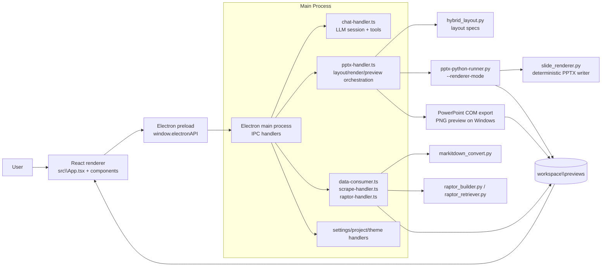
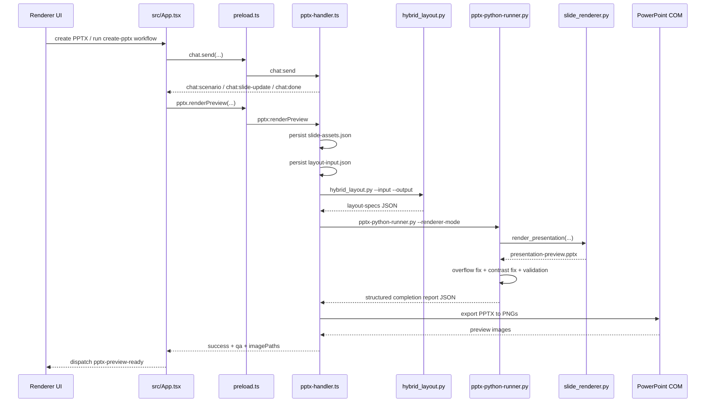
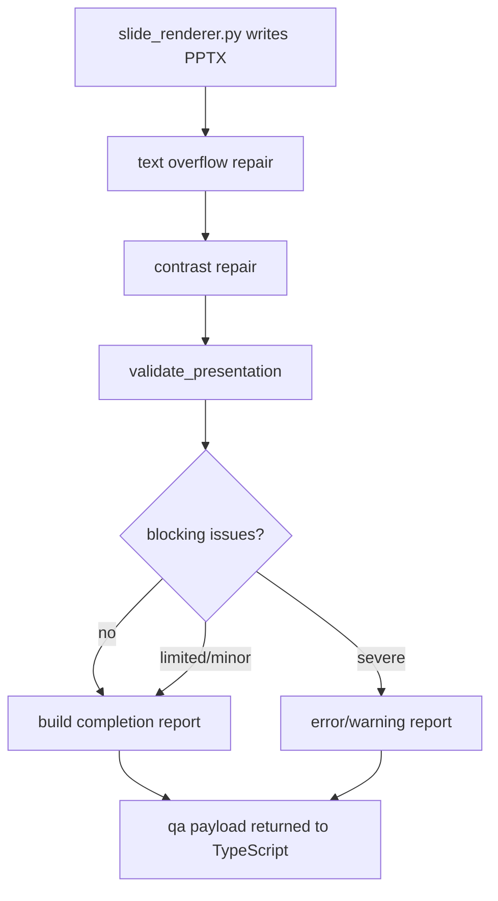
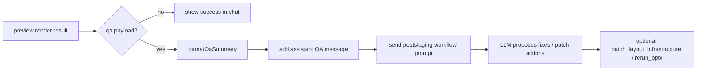
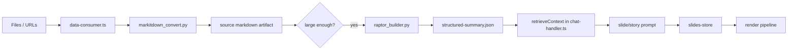

# Architecture Guide

This document explains the parts of the system that sit **around** the layout engine: app bootstrap, IPC boundaries, workspace artifacts, PPTX rendering, preview generation, and the QA loop that feeds back into chat.  
For constraint solving, zone definitions, and measurement details, see [LAYOUT_ENGINE.md](./LAYOUT_ENGINE.md).

## 1. What this codebase is optimizing for

The project is built around a few explicit architectural choices:

| Decision | Reasoning visible in code |
|---|---|
| **Electron for orchestration, Python for document work** | Electron owns UI, settings, file access, IPC, and model sessions. Python owns PPTX manipulation, text measurement, RAPTOR indexing, and Windows COM automation because those tasks are easier or more reliable in Python. |
| **Precompute geometry before rendering** | The renderer never guesses coordinates at draw time. `hybrid_layout.py` computes layout specs first, then rendering consumes those specs. |
| **Use a deterministic renderer for the active preview path** | The current render path calls `scripts\pptx-python-runner.py --renderer-mode`, which delegates to `scripts\slide_renderer.py`. Preview generation now runs through a fixed renderer with a stable layout/theme/asset contract. |
| **Keep all heavyweight work outside the renderer process** | React stays focused on state and interaction; main-process IPC handlers and Python subprocesses do the expensive work. |
| **Persist intermediate artifacts in the workspace** | `previews\layout-input.json`, `layout-specs.json`, `slide-assets.json`, preview PPTX files, and PNGs make the pipeline debuggable and replayable. |
| **Serialize PowerPoint automation** | `queuePowerPointAutomation()` ensures layout computation, PPTX rendering, and COM preview export do not race each other. |
| **Treat validation as part of rendering, not a separate audit** | The Python runner applies overflow repair, contrast repair, validation, and completion reporting before the UI considers a run finished. |
| **Make QA actionable inside the chat loop** | Preview rendering returns a structured QA payload, and the app can launch a post-staging workflow automatically when issues remain. |

## 2. High-level runtime topology



## 3. End-to-end render path

The actual render lifecycle spans four layers:

1. **Story state creation** in chat tools updates `slides-store.ts`.
2. **Preview render request** is triggered from `src\App.tsx` after the chat workflow completes in PPTX mode.
3. **Main-process orchestration** in `electron\ipc\pptx\pptx-handler.ts` refreshes workspace artifacts, computes layout specs, runs the Python renderer, and optionally exports PNG previews.
4. **Python post-processing** validates and repairs the generated PPTX before the UI accepts it.



## 4. The render pipeline in plain English

### 4.1 Storyboard and slide state

`chat-handler.ts` is the control plane for generation. It builds the prompt, opens the provider session, and exposes provider-neutral tools such as:

- `set_scenario`
- `update_slide`
- `suggest_framework`
- `patch_layout_infrastructure`
- `rerun_pptx`

Those tools do not render directly. They update the workspace model first. The canonical slide state lives in `src\stores\slides-store.ts` as `SlideWork`.

That is an important design decision: **the LLM mutates structured slide state, not the PowerPoint file directly**.

### 4.2 Transition from chat mode to render mode

`src\components\chat\ChatPanel.tsx` sets `isPptxBusy` before starting the PPTX workflow.  
When the chat stream completes, `src\App.tsx` checks `work.isPptxBusy`; if true, it calls:

```ts
window.electronAPI.pptx.renderPreview(...)
```

So the renderer does **not** render incrementally during streaming. It waits for the scenario/content pass to finish, then invokes one deterministic preview run.

### 4.3 Artifact refresh before rendering

`pptx:renderPreview` in `pptx-handler.ts` does three things before Python writes a deck:

1. writes `slide-assets.json`
2. writes `layout-input.json`
3. computes `layout-specs.json`

The key helper is `refreshPreviewArtifacts()`, which converts slide store data into the JSON contract used by Python.

### 4.4 Layout computation

`computeLayoutSpecsInternal()` runs:

```text
scripts\layout\hybrid_layout.py --input previews\layout-input.json --output previews\layout-specs.json
```

This is the handoff point from TypeScript orchestration to the layout engine. The layout engine returns a `LayoutSpec[]` JSON payload; `pptx-handler.ts` passes that payload forward through the `PPTX_LAYOUT_SPECS_JSON` environment variable.

### 4.5 Python renderer execution

`renderPresentationInternal()` calls:

```text
scripts\pptx-python-runner.py <output.pptx> --renderer-mode --workspace-dir <workspace>
```

The main process injects all runtime inputs through environment variables, including:

| Variable | Purpose |
|---|---|
| `PPTX_THEME_JSON` | active theme colors |
| `PPTX_THEME_EXPLICIT` | whether the user explicitly supplied theme colors |
| `PPTX_FONT_FAMILY` | font family selected in the palette |
| `PPTX_COLOR_TREATMENT` | solid / gradient / mixed |
| `PPTX_TEXT_BOX_STYLE` | plain / with-icons / mixed |
| `PPTX_SHOW_SLIDE_ICONS` | whether slide icons should render |
| `PPTX_DESIGN_STYLE` | selected design style |
| `PPTX_ICON_COLLECTION` | active icon collection |
| `PPTX_SLIDE_ASSETS_JSON` | per-slide image/icon metadata |
| `PPTX_TEMPLATE_PATH` | optional custom template file |
| `PPTX_TEMPLATE_META_JSON` | parsed template metadata |
| `PPTX_NOTEBOOKLM_INFOGRAPHICS` | optional NotebookLM infographic manifest |
| `PPTX_LAYOUT_SPECS_JSON` | precomputed geometry |
| `WORKSPACE_DIR` | workspace root for artifacts |

### 4.6 Deterministic slide rendering

The active renderer path is:

```text
pptx-python-runner.py --renderer-mode
  -> load env + layout specs + slide assets
  -> resolve style config + guardrails
  -> call slide_renderer.render_presentation(...)
```

That file is the most important rendering module that is **not** described in `LAYOUT_ENGINE.md`.

Its responsibilities are:

- build a `RenderContext`
- derive slide-level colors from theme + style config
- choose how each layout family becomes real PowerPoint shapes
- call shared helper utilities from `pptx-python-runner.py`
- write slides in a repeatable, tested way instead of executing arbitrary generated code

## 5. What `slide_renderer.py` adds beyond layout specs

The layout engine only answers **where things go**. `slide_renderer.py` answers:

- what shape types to use
- what fills, borders, and gradients to apply
- how theme colors and style accents combine
- how template backgrounds interact with rendered content
- where images and icons come from
- how text boxes, panels, and decorative shapes are tagged for validation

That split is intentional:

- `LAYOUT_ENGINE.md` covers **geometry**
- `slide_renderer.py` covers **visual realization**

## 6. Semantic shape roles and why they matter

One subtle but important runtime decision is the **shape semantic registry** in `pptx-python-runner.py`.

`_SHAPE_ROLE_REGISTRY` tracks whether a shape is:

- `template_design`
- `layout_managed`

This exists because validation needs to know which objects are real content and which are merely decorative/template background elements.  
Without that distinction, template ornaments would constantly trigger false overlap alarms.

The renderer registers shapes through helpers like:

- `add_managed_textbox()`
- `add_managed_shape()`
- `tag_as_design()`

That design makes validation much more reliable than relying on shape names or heuristics alone.

## 7. Validation, repair, and QA are part of rendering

The Python runner does not stop at “file written successfully.” It performs a post-render QA pass:

1. **text overflow repair**
2. **low-contrast repair**
3. **full layout validation**
4. **structured completion report generation**



Important behaviors in `pptx-python-runner.py`:

- when Pillow-based overflow measurement is available, it actively shrinks content
- when measurement is unavailable, it falls back to `TEXT_TO_FIT_SHAPE`
- it reopens the saved presentation before validation so checks run against the repaired file
- it tolerates a small number of non-overflow blocking issues, but treats text overflow as much more serious

This is why the UI receives a QA object, not just a success flag.

## 8. Post-staging feedback loop

`src\App.tsx` turns QA into another workflow step. If `pptx.renderPreview()` returns a `qa` payload, the app can automatically start the `poststaging` workflow through chat instead of silently accepting the deck.



This is another core architectural choice: **QA findings stay inside the same agent loop**, instead of being dumped to logs for a human to interpret manually.

## 9. Preview generation and why it is separate from PPTX generation

Preview images are not generated by `python-pptx`. They come from **PowerPoint COM export** on Windows.

That gives the app two different output modes:

| Output | Producer | Why |
|---|---|---|
| `.pptx` | `slide_renderer.py` via `python-pptx` | editable final deck |
| `.png` previews | PowerPoint COM export | faithful visual preview matching desktop PowerPoint |

`pptx-handler.ts` deliberately keeps these steps separate:

- generate PPTX first
- then try COM rendering
- if PNG export fails but the PPTX exists, return success with a warning

That preserves the main artifact even when preview rendering is unavailable.

There is one more important operational detail: `pptx:generate` does **not** run the renderer again. It looks up the most recent preview PPTX in `workspace\previews` and copies that file to the user-selected destination. In other words, preview generation is the canonical build step; export is a save/copy step.

## 10. How the renderer UI consumes previews

The renderer side uses a very light protocol:

1. `App.tsx` dispatches a `pptx-preview-ready` DOM event when preview generation succeeds.
2. `CenterArea.tsx` listens for that event and updates `previewImages`.
3. `PptxPreviewCard.tsx` renders each slide image through the local `pptx-local://` protocol.

`electron\main.ts` restricts that protocol to files under:

- `workspace\previews`
- `workspace\images`

So local image serving is explicit and sandboxed to known workspace roots.

## 11. Workspace artifacts that drive the whole system

These files are the real interface between layers:

| Artifact | Producer | Consumer | Meaning |
|---|---|---|---|
| `previews\layout-input.json` | `pptx-handler.ts` | `hybrid_layout.py`, `pptx-python-runner.py` | canonical slide content for layout/render |
| `previews\layout-specs.json` | `hybrid_layout.py` | `pptx-python-runner.py` | solved geometry |
| `previews\slide-assets.json` | `pptx-handler.ts` | `pptx-python-runner.py` | image/icon selections |
| `previews\presentation-preview.pptx` | Python renderer | UI export/open flows | latest generated deck |
| `previews\*.png` | PowerPoint COM | `CenterArea.tsx` | visual previews |
| `contents\data-sources\*.source.md` | `data-consumer.ts` | chat prompt builder | normalized source text |
| `contents\data-sources\*.structured-summary.json` | RAPTOR builder | chat retrieval | hierarchical retrieval index |

Persisting these files is what makes the system inspectable and recoverable.

## 12. Data ingestion and retrieval in the architecture

Although rendering is the end goal, the upstream data path matters because it shapes the prompt and the final slides.

The flow is:



The architectural point is that the app does **not** stuff full documents directly into every generation prompt. It indexes them once, then retrieves only the sections relevant to the current slide or storyboard step.

## 13. Important code hotspots

If you need to understand or change rendering behavior, these are the primary files:

| File | Why it matters |
|---|---|
| `electron\main.ts` | app bootstrap, IPC registration, local image protocol |
| `electron\preload.ts` | stable API boundary from renderer to main |
| `src\App.tsx` | ties chat completion to preview generation and post-staging QA |
| `src\components\chat\ChatPanel.tsx` | starts story vs PPTX workflows |
| `src\components\preview\CenterArea.tsx` | preview loading, rerendering, export/open commands |
| `src\stores\slides-store.ts` | canonical slide/story state |
| `electron\ipc\llm\chat-handler.ts` | prompt building, tools, workflow control plane |
| `electron\ipc\pptx\pptx-handler.ts` | artifact refresh, layout solve, Python runner launch, COM preview export |
| `scripts\layout\hybrid_layout.py` | pre-render geometry computation |
| `scripts\pptx-python-runner.py` | runtime entrypoint, repair, validation, completion report |
| `scripts\slide_renderer.py` | deterministic rendering logic |
| `scripts\style_config.py` | style presets and guardrails |
| `scripts\layout\layout_validator.py` | final validation rules |

## 14. Palette always wins — style-override precedence

Every user-facing visual control in the palette UI flows into the render pipeline through a dedicated environment variable:

| Palette control | Env var | What it affects |
|---|---|---|
| Font family | `PPTX_FONT_FAMILY` | typeface for all text |
| Color treatment | `PPTX_COLOR_TREATMENT` | solid / gradient / mixed panel fills |
| Text-box style | `PPTX_TEXT_BOX_STYLE` | plain / with-icons / mixed content style |
| Text-box corner style | `PPTX_TEXT_BOX_CORNER_STYLE` | square / rounded panel corners |
| Slide icons toggle | `PPTX_SHOW_SLIDE_ICONS` | whether decorative icons render |
| Icon collection | `PPTX_ICON_COLLECTION` | which icon set to use |

**The palette is the single source of truth for these settings.** Named design-style presets (e.g. "glassmorphism", "neo-brutalism") provide _fallback_ values, but they never override a value already supplied by the palette. This is enforced in two ways:

1. Settings that pass through `resolve_style_config()` in `style_config.py` — `color_treatment` and `text_box_corner_style` — are applied unconditionally. The function does not guard them behind the named-preset check.
2. Settings that bypass `resolve_style_config()` entirely — `text_box_style`, `font`, `slide icons`, `icon collection` — are injected directly from environment variables into the renderer, so presets never have a chance to shadow them.

`PPTX_TEXT_BOX_CORNER_STYLE` controls the rendered panel shape and a small
renderer-side spacing adjustment. It is intentionally **not** part of the
layout-solver JSON contract.

When adding a new palette control, follow the same contract: read it from an environment variable and apply it without checking whether a named preset is active. Document the new variable in the table above.

## 15. The most important architectural takeaway (two-plane design)

The system is best understood as a **two-plane design**:

1. **Control plane** — Electron + chat workflows decide *what* the deck should contain.
2. **Render plane** — Python layout + deterministic rendering decide *how* that deck is physically realized and validated.

`LAYOUT_ENGINE.md` explains one important slice of the render plane: coordinate solving.  
The rest of the render plane — artifact orchestration, deterministic slide writing, preview export, and QA feedback — lives in the files above and is what this document adds.

## 16. Short summary

In the current codebase, rendering works like this:

1. chat tools create or update structured slide state
2. the app persists layout input and slide assets into the workspace
3. `hybrid_layout.py` computes geometry
4. `pptx-python-runner.py --renderer-mode` loads the geometry and calls `slide_renderer.py`
5. the runner repairs overflow/contrast, validates the deck, and emits structured QA
6. PowerPoint COM optionally exports PNG previews
7. the UI displays previews and can route QA back into a post-staging workflow

That is the real end-to-end rendering architecture today.
