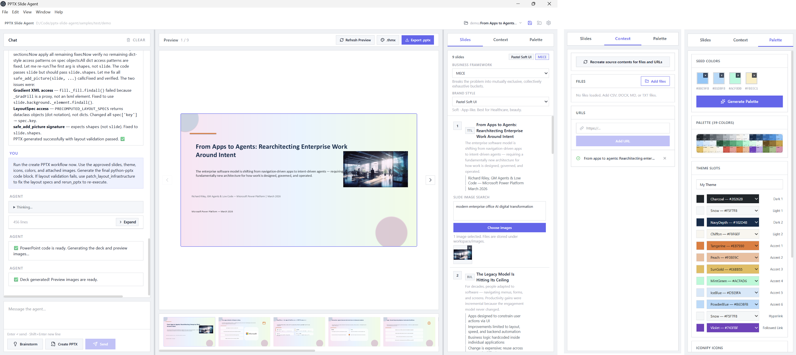
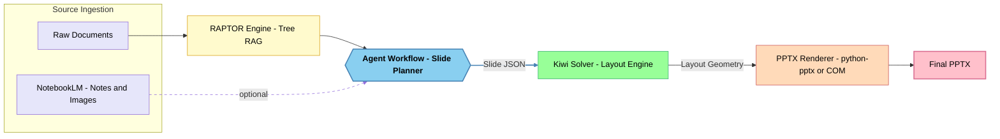

# agent-pptx-mini-notebooklm

Electron desktop app for generating PowerPoint decks from chat, files, and URLs with support for GitHub Copilot, OpenAI, Azure OpenAI, and Claude.

<p align="center">
    
</p>

This app aims to create a local, NotebookLM-style workflow for PPTX generation. It ingests source materials, grounds the content in them, and produces presentation-ready slides complete with layout, text, images, icons, and charts. Unlike NotebookLM, which generates AI images into slides, this app produces fully **editable slides** grounded in user-provided sources.   



The app uses **constraint-based layout computation** (via the Kiwi solver 🦋, an implementation of the Cassowary algorithm; **Matplotlib** uses kiwisolver internally in a limited subset of layout calculations). and **🦖 RAPTOR-style hierarchical retrieval and summarization** to structure the final output.

## Documentation Index

- [Layout Engine Whitepaper](./LAYOUT_ENGINE.md)
- [Sample PPTX Slides (Web Viewer)](https://view.officeapps.live.com/op/view.aspx?src=https%3A%2F%2Fraw.githubusercontent.com%2Fkimtth%2Fagent-pptx-mini-notebooklm%2Fmain%2Fsamples%2Fen%2Fpreviews%2Fpresentation-preview.pptx)
- [Layout Blueprint](https://view.officeapps.live.com/op/view.aspx?src=https%3A%2F%2Fraw.githubusercontent.com%2Fkimtth%2Fagent-pptx-mini-notebooklm%2Fmain%2Fsamples%2Flayout_blueprint.pptx)
- [Brand Style Samples](./public/brand-style-samples.html)

## Getting Started

Requirements:

- Node.js with `pnpm`
- `uv` and Python 3.13+
- credentials for at least one supported model provider
- Microsoft PowerPoint on Windows (Optional) — required for local preview images only; layout measurement uses Pillow font metrics. See [the details](#text-height-measurement)

Install dependencies:

```bash
pnpm install
```

Set up the Python environment once:

```bash
uv sync
```

Before running the app, decide which provider you want to use in Settings:

- GitHub Copilot with GitHub-hosted models
- GitHub Copilot with your own Azure OpenAI or Foundry deployment
- OpenAI
- Azure OpenAI
- Claude

**Recommended option** for most users: **GitHub Copilot with GitHub-hosted models**. It has the simplest setup in this app and is the most tested path.

Run the development server:

```bash
pnpm dev
```

Build:

```bash
pnpm dist
```

If `.venv` already exists and you only want to package:

```bash
pnpm dist:skip-venv
```

## Settings

**GitHub PAT permissions:**
- **Classic PAT** — no specific scope needed; the account must have an active Copilot subscription.
- **Fine-grained PAT** — Under "Permissions," click Add permissions and select **Copilot Requests**.

Choose the provider in Settings first, then enter only the matching fields:

- `GitHub Copilot` + `GitHub-hosted models`: `GITHUB_TOKEN`, `MODEL_NAME`
- `GitHub Copilot` + `Self-serving Azure OpenAI / Foundry`: `GITHUB_TOKEN`, `COPILOT_MODEL_SOURCE`, `MODEL_NAME`, Azure connection details
- `Azure OpenAI`: `MODEL_NAME`, Azure connection details
- `OpenAI`: `MODEL_NAME`, `OPENAI_API_KEY`
- `Claude`: `MODEL_NAME`, `ANTHROPIC_API_KEY`

`REASONING_EFFORT` is optional for all providers.

Notes:

- For [GitHub-hosted models](https://models.github.ai/catalog/models), use a token with Copilot entitlement.
- For Copilot with self-serving Azure, set `LLM_PROVIDER=copilot` and `COPILOT_MODEL_SOURCE=azure-openai`, then provide your Azure endpoint and authentication details in Settings.
- For Azure, use the full base URL including `/openai/v1`.
- `MODEL_NAME` can be a GitHub-hosted model name, an Azure deployment name, or another provider-specific model identifier.

## Python Environment

Datasource ingestion and PPTX generation use a local `uv`-managed Python environment so MarkItDown and `python-pptx` stay isolated from the system Python installation.

This creates `.venv` and installs the dependencies declared in [pyproject.toml](pyproject.toml). The Electron app automatically prefers that interpreter for both content ingestion and PPTX generation.

For packaged builds, `.venv` is bundled into the app's `resources` directory. `pnpm dist:skip-venv` only skips recreating the environment; it still requires an existing `.venv` in the repo root.

### python-pptx

https://python-pptx.readthedocs.io/

PPTX generation runs through a bundled Python runner at [scripts/pptx-python-runner.py](scripts/pptx-python-runner.py), which executes agent-generated `python-pptx` code with runtime variables including `OUTPUT_PATH`, `PPTX_TITLE`, `PPTX_THEME`, `PPTX_COLOR_TREATMENT`, and `PPTX_TEXT_BOX_STYLE`.

In the Palette panel, `Mixed` is the default for both `Text Box Type` and `Text Box Fill Style`; it adaptively chooses icon usage and fill treatment by slide context.

### Embedding Model & RAPTOR Retrieval

Long documents are indexed into a **[RAPTOR](https://arxiv.org/abs/2401.18059) tree** (Recursive Abstractive Processing for Tree-Organized Retrieval) for targeted per-chunk context injection during PPTX generation.

| Component | Path | Role |
|-----------|------|------|
| `embed_service.py` | `scripts/raptor/` | Local embedding via [multilingual-e5-small](https://huggingface.co/intfloat/multilingual-e5-small) ONNX (384-dim, 100+ languages, INT8 quantized ~118 MB) |
| `raptor_builder.py` | `scripts/raptor/` | Splits markdown → embeds sections → agglomerative clustering → hierarchical tree; uses a content-length-adaptive section threshold (`_heading_section_threshold()`: ~1 section per 3 KB, clamped 2–8) to decide when heading-based splitting is sufficient before falling back to semantic paragraph splitting |
| `raptor_retriever.py` | `scripts/raptor/` | Per-chunk cosine retrieval across all tree levels → top-K relevant sections |
| `raptor-handler.ts` | `electron/ipc/data/` | TypeScript IPC wrapper calling Python scripts via `execFile` |
| `download_model.py` | `scripts/raptor/` | Downloads model from HuggingFace (automated in `pnpm dist`) |

**Pipeline:** At ingestion, `data-consumer.ts` calls `buildRaptorTree()` which writes a `.structured-summary.json` with the RAPTOR tree and embeddings. At generation time, `chat-handler.ts` calls `retrieveContext()` with slide-derived queries, injecting only the most relevant sections (~12 KB) instead of the full document (~123 KB) into each chunk prompt.

Model files are stored at `resources/models/embed/` (git-ignored) and bundled into packaged builds via `electron-builder.yml`. Run `pnpm setup:models` to download manually, or let `pnpm dist` handle it automatically.

### Layout Engine

Layout modules live in `scripts/layout/` and compute content-adaptive slide coordinates **before** the LLM generates `python-pptx` code.

#### Execution Order

```
pptx-handler.ts
  │
  ├─ 1. computeLayoutSpecs()          Call hybrid_layout.py as subprocess
  │       ↓
  │     hybrid_layout.py               Orchestrator (CLI entry point)
  │       ├─ layout_blueprint.py       Load declarative zone definitions
  │       ├─ font_text_measure.py      Measure text heights via Pillow font metrics (cross-platform)
  │       └─ constraint_solver.py      Solve zone positions with kiwisolver
  │             └─ layout_specs.py     Emit LayoutSpec / RectSpec dataclasses
  │       ↓
  │     LayoutSpec JSON (stdout)
  │
  ├─ 2. executeGeneratedPythonCodeToFile()
  │       ↓  PPTX_LAYOUT_SPECS_JSON env var
  │     pptx-python-runner.py          Deserialize specs → PRECOMPUTED_LAYOUT_SPECS
  │       └─ exec(generated code)      LLM code uses specs for positioning
  │
  └─ 3. Post-generation
          layout_validator.py           Validate overlap, bounds, text overflow
```

| Module | Role |
|--------|------|
| `hybrid_layout.py` | Orchestrator + JSON serialization + CLI entry point; uses Pillow measurement with heuristic fallback |
| `layout_blueprint.py` | Declarative zone definitions for 14 layout types |
| `font_text_measure.py` | Text height measurement via Pillow font metrics (cross-platform, ~90–95% accuracy) |
| `constraint_solver.py` | Kiwisolver (Cassowary) constraint solver → `LayoutSpec` |
| `layout_specs.py` | `LayoutSpec` / `RectSpec` dataclasses and `flow_layout_spec()` cascade helper |
| `layout_validator.py` | Post-generation validation (overlap, bounds, text overflow) |

Pre-computed specs are injected as `PRECOMPUTED_LAYOUT_SPECS` into the generated code namespace. Requires `kiwisolver`.

Hybrid layout artifacts are stored in the active workspace under `previews/`:
- `layout-input.json` — the storyboard-derived `SlideContent[]` payload written immediately when the slide scenario is set and refreshed again before layout computation
- `layout-specs.json` — the computed `LayoutSpec[]` output written by `hybrid_layout.py`

##### Text height measurement

- **Pillow font-metrics** — cross-platform: simulates word-wrap via TrueType glyph metrics; accurate enough for layout planning *(~90–95% accuracy)*
- **Heuristic fallback** — uses the shared text-height estimator only if Pillow is unavailable
- **Auto-size** — post-generation escape hatch: sets `TEXT_TO_FIT_SHAPE` on shapes and lets PowerPoint shrink text at open time when overflow repair still cannot reclaim enough space

## Persistent Storage

App data is stored in the Electron `userData` directory:

| File | Path (Windows) | Description |
|------|----------------|-------------|
| `settings.json` | `%APPDATA%\pptx-slide-agent\settings.json` | API keys, model settings, and other preferences |
| `workspace.json` | `%APPDATA%\pptx-slide-agent\workspace.json` | Last-used workspace directory |

On macOS the equivalent path is `~/Library/Application Support/pptx-slide-agent/`.

### Project Files

Work can be saved and loaded as `.pptapp` project files (JSON). A project snapshot includes:
- Slide outline / story content
- Chat message history
- Full palette configuration (theme slots and tokens)

## Preview

The center preview panel renders local slide PNGs generated from the preview PPTX. Use `Load Preview` to read cached images from the workspace, `Rerender` to export fresh images from PowerPoint via COM, and `Open in PowerPoint` to launch the latest preview deck in the desktop app.

## Agentic Workflows

Prompt workflow files live here:

- [workflows/prestaging.md](workflows/prestaging.md)
- [workflows/create-pptx.md](workflows/create-pptx.md)
- [workflows/poststaging.md](workflows/poststaging.md)

Workflow loading is provider-neutral. The provider-specific runtime wiring lives in [electron/ipc/llm](electron/ipc/llm).

## NotebookLM Integration

The app can generate infographic images and slide decks from [Google NotebookLM](https://notebooklm.google/) notebooks via the unofficial `notebooklm-py` library.

Requirements:

- `notebooklm-py` installed in the project `.venv` (declared in `pyproject.toml`)
- one-time `notebooklm-py` library login completed in the project environment

Browser sign-in at `https://notebooklm.google/` is not sufficient by itself. The app checks the `notebooklm-py` library's stored session, so use the in-app **Open NotebookLM Login** action or run `python -m notebooklm login` from the project `.venv`, complete the browser sign-in, then press ENTER in that terminal to save the session.

In the slide panel, toggle **NotebookLM Infographic** to select a notebook and generate an infographic PNG saved to the workspace `images/` folder.
